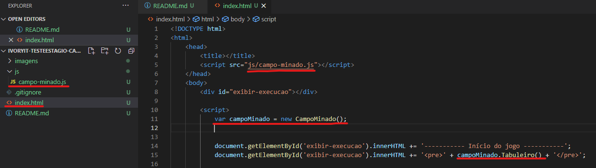
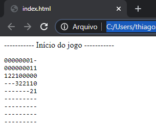

# Desafio Campo Minado
O jogo foi bastante difundido pelo sistema operacional Windows nos anos 90.
Robert Donner e Curt Johnson foram contratados pela Microsoft em 1989. Curt tinha escrito um programa para o sistema operacional da IBM(OS/2), cujo objetivo era você conseguir atravessar um campo minado de um canto da tela para outro ileso. Robert queria escrever um jogo para Windows para aprimorar sua programação no sistema operacional, e Curt deixou que ele utilizasse o seu código fonte como ponto de partida. Mais tarde a Microsoft decidiu lançar uma coleção de jogos para sua nova plataforma e os funcionários foram convidados a enviar jogos. O campo minado foi enviado e um dos escolhidos a pertencer ao sistema operacional.

## Objetivo do jogo
O jogo consiste em uma matriz quadrada, que ao primeiro clique revela algumas posições. A partir das posições reveladas o jogador devera descobrir todos as posições que não contêm minas terrestres sem ser "explodido". A localização das minas terrestres é descoberta através de um processo lógico, onde o número de uma determinada posição representa a quantidade de minas terrestres em volta dele.

# Desafio
Neste repositório existe uma página web (index.html) que importa o script campo-minado.js que realiza instância a classe CampoMinado.

Está classe é responsável por iniciar um novo jogo do campo minado. Nela temos disponíveis os seguintes métodos:

 - `campoMinado.Tabuleiro()`: Retorna o tabuleiro atual no formato de `string`. Veja o que acontece quando imprimimos seu valor na página (Linha 15 da imagem anterior):

 

    - `Valores númericos`: Números de minas terrestres que a posição possui em volta;
    - `Traço (-)`: Posições que ainda não foram abertas, a qual o seu algoritmo deve analisar a string retornada pelo método Tabuleiro() e tomar a decisão de abrir ou não.
- `campoMinado.JogoStatus()`: Método que retorna (inteiro) o status do jogo atual. A cada tentativa de abertura de uma posição o seu retorno é diferente.
    - `0`: Jogo em aberto, continue procurando as posições que não possuem minas terrestres;
    - `1`: Vitoria, você encontrou todas as posições que não possuem minas terrestres;
    - `2`: Game Over, você encontrou uma mina terrestre.
- `campoMinado.Abrir(int linha, int coluna)`: Método responsável por abrir uma posição. Como o tabuleiro é uma matriz 9x9 , você deve informar linha e coluna entre 1 e 9 para abrir. Sempre que você pedir para abrir uma posição o retorno do método Tabuleiro() é atualizado com a posição aberta e o método JogoStatus() ao executar irá retornar o novo status (0, 1 ou 2). 

Como todos sabem, uma string é um vetor de caracteres, portanto o objetivo do algoritmo é realizar a leitura da string retornada pelo método Tabuleiro() utilizando a lógica de identificação das minas terrestres conforme a sessão objetivo do jogo. Após analisar e identificar que é seguro abrir uma posição, seu algoritmo deve chamar o método Abrir(linha, coluna) da classe CampoMinado. Ao abrir todas as posições que não possuem minas terrestres o método JogoStatus() irá passar retornar o valor 1 de vitória.

## Dicas / Regras
1. Ao codificar matenha seu código limpo e coerente. Manter padronização ajuda a equipe entender o que foi codificado, além de ajudar nas manutenções futuras;
2. O arquivo `campo-minado.js` não pode ser modificado;
3. O algoritimo deve analisar a string que representa o tabuleiro, não é valido fixar a abertura das posições que não possuem minas terrestres pela analise do algoritmo `campo-minado.js`;
4. Não é para criar uma aplicação onde o usuário escolha qual posição abrir, é para ser um algoritimo autonomo que realize as jogadas;
5. Exemplo de um algotimo realizando as jogadas até encontrar todas as posições sem minas terrestres:

